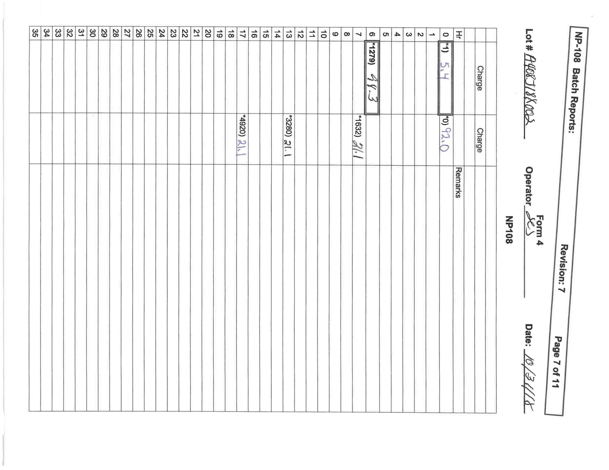
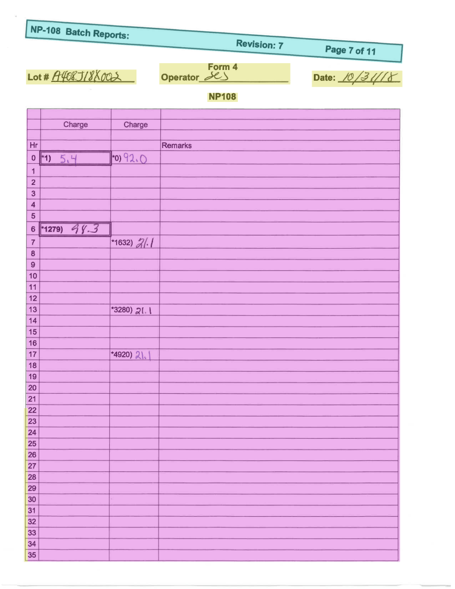

# This repo is for LearningPal document processing service testing.

## The goal of this service is to provide API that perform image based document analysis, give back 
* 1. Layout analysis - region segmentation (Image, Table, Text, Form, etc.)
* 2. Image auto correction (orientation correction)
* 3. Table detection and (structure)recognition
* 4. Text detection and OCR
* 5. Handwriting detection and Recognition
* 6. Formula detection and Recognition
* 7. Image caption

----------
#### Update 12-10-2019
##### 1. Layout analysis
##### 2. Image auto correction (orientation correction)
##### 3. Table detection and (structure)recognition

----------
## Requirements
1. Document File, can be Image or PDF
2. High quality is recommended
-----
## How to test:
##### Clone this repo
##### POST sample image to see result
```
python request_POST.py
```
##### Or POST with your own file
```
python request_POST.py <PATH>
```
##### result JSON file get_```result.json``` will be save under root
----
## Sample Demo:
###### Sample1 image


###### Result of sample1


-  `Table region`
-  `unknow closed region`
-  `Text region`