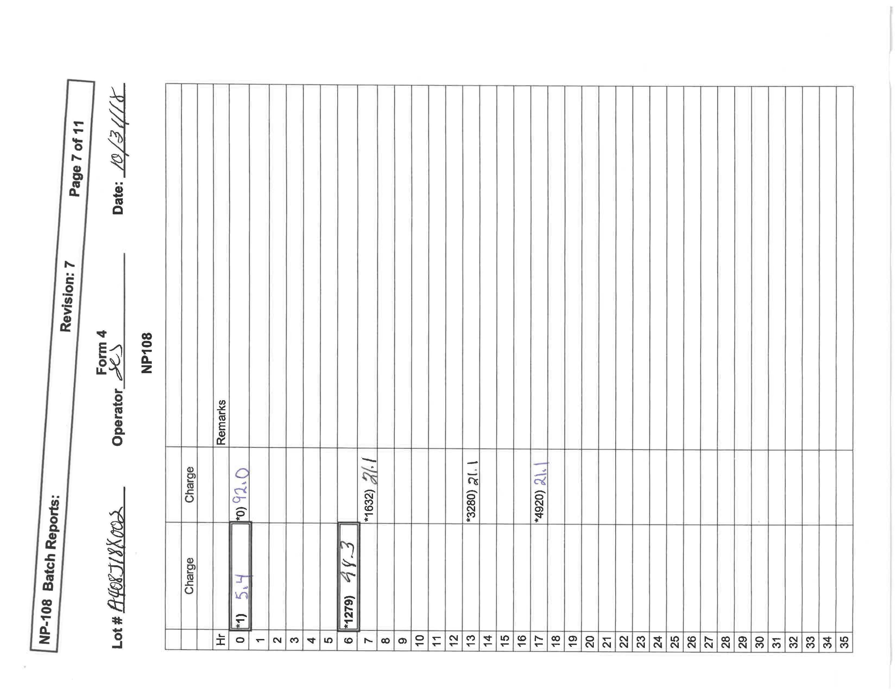

# This repo is for LearningPal document processing service testing.

## The goal of this service is to provide API that perform image based document analysis
* 1. Layout analysis - region segmentation (Image, Table, Text, Form, etc.)
* 2. Image auto correction (orientation correction)
* 3. Table detection and (structure)recognition
* 4. Text detection and OCR
* 5. QR code/bar code detection and recognition
* 6. Handwriting detection and Recognition
* 7. Output Excel if necessary


----------
## How to test:
##### 1. Get a valid key from admin, paste the key flag in ```request_POST.py``` 
##### 2. POST sample image to see result (High quality image recommanded)
```
python request_POST.py
```
##### Or POST with your own file. (language flag is option, default: English)
```
python request_POST.py sample1.jpeg ENG
```
##### 3. ```result.json``` will be save under root
##### Each page has ```render_img_url_``` key, which is the layout demostrate of the page with color
----
## Sample Demo:
###### Sample1 image


###### Result of sample1 in spreadsheet format


-  `Low confidence`
-  `High confidence`
-  `Could be wrong`